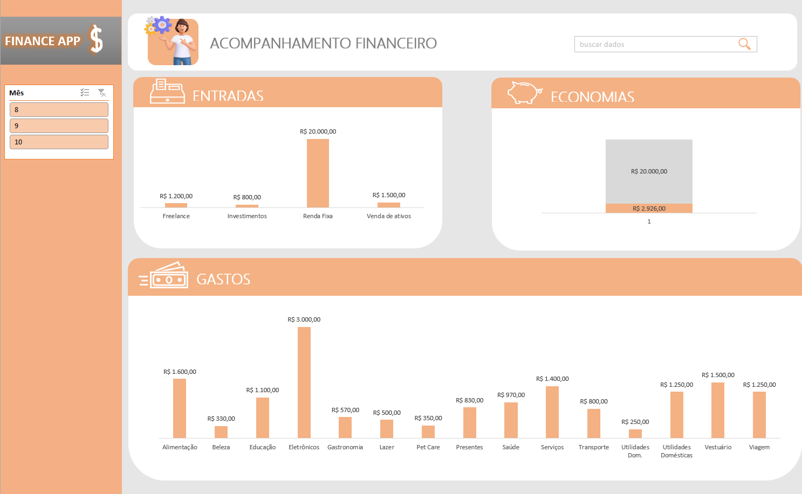

# Projeto Planilhas Inteligentes com IA

> ℹ️ **NOTE:** Este é um repositório criado durante o curso "Como organizar sua vida Financeira com Planilhas Inteligentes e IA", promovido pela [DIO](https://dio.me) na programação de conteúdos do Bootcamp __CAIXA - IA Generativa com Microsoft Copilot__.

Projeto com o objetivo de criar planilhas em Excel, um dashboard de acompanhamento financeiro e obter insigths a partir da base de dados com alguma ferramenta de IA.         
         

                                                                                                                          
                                                                                                                                                                                       
> Acesse o [Dashboard](outputs/controle-financeiro.xlsx)   

---  

## 💻 Tecnologias utilizadas

- [Microsoft Excel](https://www.microsoft.com/pt-br/microsoft-365/excel) 
- [Buscador Google](https://www.google.com.br)
- [Remove.bg](https://www.remove.bg/pt-br)
- [Microsoft Copilot](https://copilot.microsoft.com/)  

---  

## ✨ Como foi feito?

- Planilhas e dashboard elaborados com o Microsoft Excel
- Recursos gráficos buscados no Google
- Edição de imagem com Remove.bg  

---  

## 📚 Materiais  
   
- [Base de dados](assets/base-de-dados.xlsx)
- [Database para insights](assets/database.xlsx)

  

---  

## 🛠️ Instruções de execução

Utilize a base de dados fornecida pelo instrutor para criar as planilhas no aplicativo Excel. Depois de gerar o dashboard, as abas Dados, Controlador e Caixinha podem ser ocultadas.  

- 🤖 1. Use o prompt de insigths no `Copilot` sobre gastos: "Utilize a tabela de dados acima como base de conhecimento e gere alguns insights dessa tabela de gastos."

Ver [insights 1](outputs/insights1.pdf)   

- 🤖 2. Use o prompt de insigths no `Copilot` para obter visão detalhada: "Gere uma nova planilha para visão detalhada dos dados da tabela original, incluindo totais de receita e despesa, distribuição de despesas por categoria e a contagem dos status das transações."

Ver [insights 2](outputs/insights2.pdf)     

---  

## 👨‍💻 Expert

[Carla Silveira](https://github.com/rosacarla)
